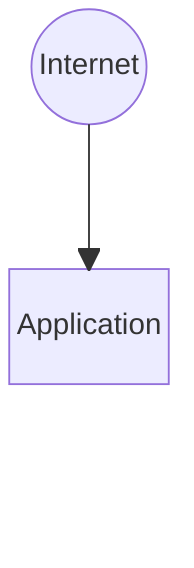
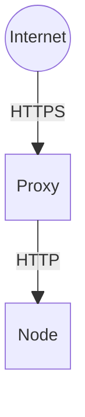

---
# try also 'default' to start simple
theme: seriph
# random image from a curated Unsplash collection by Anthony
# like them? see https://unsplash.com/collections/94734566/slidev
background: https://cover.sli.dev
# some information about your slides, markdown enabled
title: Javascript as backend
info: |
  ## Javascript as backend
  Presentation slides for developers.

  Learn more at [Sli.dev](https://sli.dev)
# apply any unocss classes to the current slide
class: text-center
# https://sli.dev/custom/highlighters.html
highlighter: shiki
# https://sli.dev/guide/drawing
drawings:
  persist: false
# slide transition: https://sli.dev/guide/animations#slide-transitions
transition: slide-left
# enable MDC Syntax: https://sli.dev/guide/syntax#mdc-syntax
mdc: true
---

# Javascript as backend

<center></center>

---

# What are we talking about

- Diving into Javascript
- Asynchronous
- NodeJS and Express
- Libraries
- NestJS framework
- 

---

<center>

# Dive into javascript


</center>

---

# Javascript is weird

<div v-click.hide>
```ts {monaco}
console.log("11" - 1);
```
</div>
<div v-after>
```ts {monaco-run}
console.log("11" - 1);
```
</div>

<div v-click.hide>
```ts {monaco}
console.log("11" + 1);
```
</div>
<div v-after>
```ts {monaco-run}
console.log("11" + 1);
```
</div>

<div v-click.hide>
```ts {monaco}
console.log(0.1 + 0.2 === 0.3);
```
</div>
<div v-after>
```ts {monaco-run}
console.log(0.1 + 0.2 === 0.3);
```
</div>

<div v-click.hide>
```ts {monaco}
console.log(17841401206000151)
```
</div>
<div v-after>
```ts {monaco-run}
console.log(17841401206000151)
```
</div>

<div v-click.hide>
```ts {monaco}
console.log([5, 4, 10000, 3, 2, 1].sort())
```
</div>
<div v-after>
```ts {monaco-run}
console.log([5, 4, 10000, 3, 2, 1].sort())
```
</div>

<style>
.slidev-vclick-hidden { display: none; }
</style>

---

# Javascript is weird #2

<div v-click.hide>
```ts {monaco}
console.log(0 == "0");
```
</div>
<div v-after>
```ts {monaco-run}
console.log(0 == "0");
```
</div>

<div v-click.hide>
```ts {monaco}
console.log(0 == []);
```
</div>
<div v-after>
```ts {monaco-run}
console.log(0 == []);
```
</div>

<div v-click.hide>
```ts {monaco}
console.log("0" == []);
```
</div>
<div v-after>
```ts {monaco-run}
console.log("0" == []);
```
</div>

<div v-click.hide>
```ts {monaco}
console.log([1,2,3] + [4,5,6]);
```
</div>
<div v-after>
```ts {monaco-run}
console.log([1,2,3] + [4,5,6]);
```
</div>

<div v-click.hide>
```ts {monaco}
console.log(typeof ([] + []));
```
</div>
<div v-after>
```ts {monaco-run}
console.log(typeof ([] + []));
```
</div>

<style>
.slidev-vclick-hidden { display: none; }
</style>

---

# Javascript is weird #3

<div v-click.hide>
```ts {monaco}
console.log(('b' + 'a' + + 'a' + 'a').toLowerCase());
```
</div>
<div v-after>
```ts {monaco-run}
console.log(('b' + 'a' + + 'a' + 'a').toLowerCase());
```
</div>

<div v-click.hide>
```ts {monaco}
console.log(parseInt(0.0000005));
```
</div>
<div v-after>
```ts {monaco-run}
console.log(parseInt(0.0000005));
```
</div>

<div v-click.hide>
```ts {monaco}
console.log(typeof null);
```
</div>
<div v-after>
```ts {monaco-run}
console.log(typeof null);
```
</div>

<div v-click.hide>
```ts {monaco}
console.log(Object.keys(null));
```
</div>
<div v-after>
```ts {monaco-run}
console.log(Object.keys(null));
```
</div>

<div v-click.hide>
```ts {monaco}
console.log(typeof NaN);
```
</div>
<div v-after>
```ts {monaco-run}
console.log(typeof NaN);
```
</div>


<style>
.slidev-vclick-hidden { display: none; }
</style>

---

# It's async!

you'll be awaiting everything

- Non blocking
- Improved performance
- Better user experience
- You'll need to wait for that async database call anyway
- Worse code?

---

# It's async - then() chaining

```js
function doSomeComplicatedThingsInOrder() {
  return getUser()
    .then((user) => {
      return getItemsForUser(user);
    })
    .then((items) => {
      return someOtherAsyncFunction(items);
    })
    .then((results) => {
      return results.map((result) => result.id);
    });
}

```

<div v-click>

- Code gets messy with larger callbacks
- Harder to follow what's happening in ```doSomeComplicatedThingsInOrder``` function
- Scope of variables might be difficult to determine

</div>

---

# It's async - await

```js
async function doSomeComplicatedThingsInOrder() {
  const user = await getUser();
  const items = await getItemsForUser(user);
  const results = await someOtherAsyncFunction(items);

  return results.map((result) => result.id);
}

```

<div v-click>

- Code is much easier to read
- Easy to understand what ```doSomeComplicatedThingsInOrder``` function is doing
- Scope of variables is easy to determine

</div>

---

# It's async! - Example

```js
async function asyncFunction(duration = 2000) {
  console.log('Starting async function');
  return new Promise((resolve) => {
    setTimeout(() => {
      console.log('Async function done');
      resolve();
    }, duration);
  });
}

// Start function and return
app.get('/async', (req, res) => {
  asyncFunction();
  res.send("Message received"); // Response is instant, asyncFunction runs 'in background'
})

// Start function and wait for it to finish
app.get('/async-await', async (req, res) => {
  await asyncFunction();
  res.send("Message received"); // Respose is much later, waits for asyncFunction to complete
})
```

---

# It's async! - Waiting

```js
// Start function and wait for it to finish
app.get('/async-await', async (req, res) => {
  await asyncFunction();
  res.send("Message received"); // Respose is much later, waits for asyncFunction to complete
})
```

<div v-click.hide>
```ts {monaco}
const time = new Date().getTime();
const response = await fetch("http://localhost:3000/async-await");
console.log(new Date().getTime() - time + 'ms');
```
</div>
<div v-after>
```js {monaco-run}
const time = new Date().getTime();
const response = await fetch("http://localhost:3000/async-await");
console.log(new Date().getTime() - time + 'ms');
```
</div>

<style>
.slidev-vclick-hidden { display: none; }
</style>

---

# It's async! - No Waiting

```js
// Start function and return
app.get('/async', (req, res) => {
  asyncFunction();
  res.send("Message received"); // Response is instant, asyncFunction runs 'in background'
})
```

<div v-click.hide>
```ts {monaco}
const time = new Date().getTime();
const response = await fetch("http://localhost:3000/async");
console.log(new Date().getTime() - time + 'ms');
```
</div>
<div v-after>
```js {monaco-run}
const time = new Date().getTime();
const response = await fetch("http://localhost:3000/async");
console.log(new Date().getTime() - time + 'ms');
```
</div>

<style>
.slidev-vclick-hidden { display: none; }
</style>

---

# I want this on my server

node logo

---
layout: two-cols-header
---

# The application is your server
::left::

## Node



::right::
<div v-click>

## PHP


</div>

<style>
.two-cols-header { grid-template-rows: auto!important; }
</style>

---

# The application is your server

- The whole application is loaded in memory

---

# Simple example

```js {monaco}
// Import requirements
import express from "express";

// Create app
const app = express();

// Add a route
app.get('/', (req, res) => {
  res.send('Hello World!');
});

// Start the application
app.listen(3000, () => console.log('Example app is listening on port 3000.'));
```

<div v-click.hide>
```ts {monaco}
const response = await fetch("http://localhost:3000");
console.log(await response.text());
```
</div>
<div v-after>
```js {monaco-run}
const response = await fetch("http://localhost:3000");
console.log(await response.text());
```
</div>


<style>
.slidev-vclick-hidden { display: none; }
</style>


---

# Taking it to production

````md magic-move
```js
// Import requirements
import express from "express";

// Create app
const app = express();

// Add a route
app.get('/', (req, res) => {
  res.send('Hello World!');
});

// Start the application
app.listen(3000, () => console.log('Example app is listening on port 3000.'));
```
```js
// Import requirements
import express from "express";
import cors from "cors"; // Cross-origin resource sharing plugin for express

// Create app
const app = express();
app.use(cors());

// Add a route
app.get('/', (req, res) => {
  res.send('Hello World!');
});

// Start the application
app.listen(3000, () => console.log('Example app is listening on port 3000.'));
```
```js
// Import requirements
import express from "express";
import cors from "cors"; // Cross-origin resource sharing plugin for express
import helmet from "helmet"; // Hardening response headers

// Create app
const app = express();
app.use(cors());
app.use(helmet());

// Add a route
app.get('/', (req, res) => {
  res.send('Hello World!');
});

// Start the application
app.listen(3000, () => console.log('Example app is listening on port 3000.'));
```

```js
// Import requirements
import express from "express";
import cors from "cors"; // Cross-origin resource sharing plugin for express
import helmet from "helmet"; // Hardening response headers
import bodyParser from "body-parser"
import hpp from "hpp"; // Protect agains parameter pollution

// Create app
const app = express();

app.use(bodyParser.urlencoded({
  extended: true
}))

app.use(cors());
app.use(helmet());
app.use(hpp());

// Add a route
app.get('/', (req, res) => {
  res.send('Hello World!');
});

// Start the application
app.listen(3000, () => console.log('Example app is listening on port 3000.'));
```
```js
// Import requirements
import fs from "fs";
import express from "express";
import cors from "cors"; // Cross-origin resource sharing plugin for express
import helmet from "helmet"; // Hardening response headers
import bodyParser from "body-parser"
import hpp from "hpp"; // Protect against parameter pollution
import csurf from "csurf"; // Protect against cross-site request forgery
import session from "express-session";
import https from "https"; // Enable https

var key = fs.readFileSync(__dirname + '/../certs/selfsigned.key');
var cert = fs.readFileSync(__dirname + '/../certs/selfsigned.crt');
var options = {
  key: key,
  cert: cert
};

// Create app
const app = express();

app.use(bodyParser.urlencoded({
  extended: true
}))

server.use(session({
  secret: process.env.SESSION_SECRET,
  name: "session",
  resave: false,
  saveUninitialized: true,
  cookie: {
    secure: true,
    httpOnly: true,
    sameSite: true
  }
}))

const csrfMiddleware = csurf({
  sessionKey: "session"
})

app.use(cors());
app.use(helmet());
app.use(hpp());

// Add a route
app.get('/', csrfMiddleware, (req, res) => {
  res.send('Hello World!');
});

// Start the application
app.listen(3000, () => console.log('Example app is listening on port 3000.'));
```
````

---

<center>

# This feels like doing DevOps


</center>

--- 

<center>

# Do it like PHP

Add a proxy that handles HTTPS offloading and hardening.  
Less worry about HTTP security in your code.



</center>
---

<center>

# Let's add a framework


</center>

---

# PHP can be a mess too

```php
/* Include the PDO connection script */
include 'db_inc_pdo.php';

/* Query #1: create the table structure */
$order_products_query = 
'CREATE TABLE `order_products` (
  `id` int(10) UNSIGNED NOT NULL,
  `order_id` int(10) UNSIGNED NOT NULL,
  `product_id` int(10) UNSIGNED NOT NULL
) ENGINE=InnoDB DEFAULT CHARSET=utf8';
/* Execute the SQL query */
try
{
   $res = $pdo->prepare($order_products_query);
   $res->execute();
}
catch (PDOException $e)
{
   /* If there is an error an exception is thrown */
   echo 'Query error: ' . $e->getMessage();
   die();
}

echo 'Orders table created successfully<br>';

/* Query #2: set the primary key */
$orders_pk = 'ALTER TABLE `order_products` ADD PRIMARY KEY (`id`)';
/* Execute the SQL query */
try
{
   $res = $pdo->prepare($orders_pk);
   $res->execute();
}
catch (PDOException $e)
{
   /* If there is an error an exception is thrown */
   echo 'Query error: ' . $e->getMessage();
   die();
}
echo 'Primary key added successfully<br>';

/* Query #3: set the auto-increment */
$orders_ai = 'ALTER TABLE `order_products` MODIFY `id` int(10) UNSIGNED NOT NULL AUTO_INCREMENT';
/* Execute the SQL query */
try
{
   $res = $pdo->prepare($orders_ai);
   $res->execute();
}
catch (PDOException $e)
{
   /* If there is an error an exception is thrown */
   echo 'Query error: ' . $e->getMessage();
   die();
}
echo 'Auto-increment set successfully<br>';
```

---

<center>

# About those JS libraries


</center>

---

# About those JS libraries - Famous example

<div v-click.hide>
```ts {monaco}
function famousCode(str, len, ch) {
  str = String(str);

  var i = -1;

  if (!ch && ch !== 0) ch = ' ';

  len = len - str.length;

  while (++i < len) {
    str = ch + str;
  }

  return str;
}
```
</div>
<div v-after>
```js {monaco-run}
function leftpad(str, len, ch) {
  str = String(str);

  var i = -1;

  if (!ch && ch !== 0) ch = ' ';

  len = len - str.length;

  while (++i < len) {
    str = ch + str;
  }

  return str;
}

console.log(leftpad('wow', 20, '-'))
```
</div>

<style>
.slidev-vclick-hidden { display: none; }
</style>

---

# About those JS libraries - Finding the right libraries

- Look for github stars ⭐⭐⭐⭐
- Look for amount of weekly-downloads on NPM
- Look for corporate sponsors
- Do you even need an external library for that? 
  - leftPad
  - isOdd/isEven

---

# NestJS

logo, sponsors, typescript

- TypeScript
- Controllers
- Services
- Dependency Injection
- Jobs
- Queue
- Scheduler
- Documentation

All with starting a single process

--- 

# NestJS - Some examples

```ts
import { Controller, Get } from '@nestjs/common';
import { UserService } from './user.service';

@Controller()
export class UserController {
  constructor(private readonly service: UserService) {}

  @Get('/users')
  getAll(@Body() data: ValidatedFilterDto): Promise<User[]> {
    return this.service.getAll(data);
  }
}
```

```ts
import { Injectable } from '@nestjs/common';
import { DatabaseClient } from '@libs/database';

@Injectable()
export class UserService {
  constructor(private readonly databaseClient: DatabaseClient) {}

  getAll(filters: { firstname: string, lastname: string }): Promise<User[]> {
    return this.databaseClient.getAllUsers();
  }
}
```

---

# NestJS - Some examples

````md magic-move
```ts
import { Controller, Get } from '@nestjs/common';
import { UserService } from './user.service';

@Controller()
export class UserController {
  constructor(private readonly service: UserService) {}

  @Get('/users')
  getAll(@Body() data: ValidatedFilterDto): Promise<User[]> {
    return this.service.getAll(data);
  }
}
```
```ts
import { Controller } from '@nestjs/common';
import { MessagePattern } from '@nestjs/microservices';
import { UserService } from './user.service';

@Controller()
export class UserController {
  constructor(private readonly service: UserService) {}

  @MessagePattern('get-users')
  getAll(@Body() data: ValidatedFilterDto): Promise<User[]> {
    return this.service.getAll(data);
  }
}
```
```ts
import { Controller, UseGuards } from '@nestjs/common';
import { MessagePattern } from '@nestjs/microservices';
import { UserService } from './user.service';
import { UserGuard } from './user.guard';

@Controller()
export class UserController {
  constructor(private readonly service: UserService) {}

  @MessagePattern('get-users')
  @UseGuards(UserGuard)
  getAll(@Body() data: ValidatedFilterDto): Promise<User[]> {
    return this.service.getAll(data);
  }
}
```
```ts
import { Controller, UseGuards } from '@nestjs/common';
import { MessagePattern } from '@nestjs/microservices';
import { CacheInterceptor } from '@nestjs/cache-manager';
import { UserService } from './user.service';
import { UserGuard } from './user.guard';

@Controller()
export class UserController {
  constructor(private readonly service: UserService) {}

  @MessagePattern('get-users')
  @UseGuards(UserGuard)
  @UseInterceptors(CacheInterceptor)
  getAll(@Body() data: ValidatedFilterDto): Promise<User[]> {
    return this.service.getAll(data);
  }
}
```
````

---

# NestJS - Scheduler

```ts
import { Injectable, Logger } from '@nestjs/common';
import { Cron } from '@nestjs/schedule';

@Injectable()
export class TasksService {
  private readonly logger = new Logger(TasksService.name);

  @Cron('45 * * * * *')
  handleCron() {
    this.logger.debug('Called when the current second is 45');
  }
}
```
---

# NestJS - Your application is the webserver

- Application is long running process, also active when there is no requests
- Be carefull with class scoped variables, classes only get instantiated once for the runtime of the app (not the request!)
- Schedulers/Queues run in a single process (no need for seperate services)

```ts
@Injectable()
export class UserService {
  private user: User;
  constructor(private readonly databaseClient: DatabaseClient) {}

  async get(id: number): Promise<User> {
    if (!this.user) {
      this.user = await this.databaseClient.getUser(id);
    }

    return this.user;
  }
}
```

---

# Maybe demo?
php vs js?

---

# Conclusion

- Javascript is easy to get started with.
- Using Typescript and NestJS makes it possible to create high quality software.
- Be careful when selecting 3rd party libraries (counts for PHP too though).
- 

--- 

# Questions?


